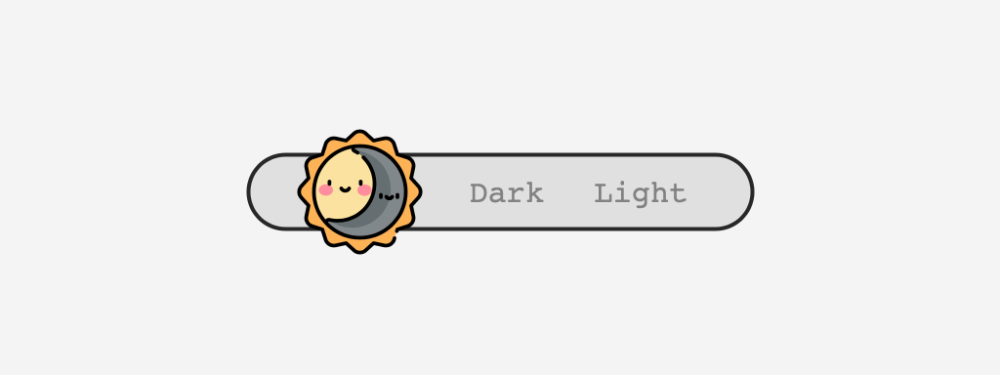

<div align="center">

# `next-dark-mode`

🌓 Theme your Next.js apps with a Dark Mode

[](https://github.com/xeoneux/next-dark-mode/blob/master/LICENSE)
[](https://bundlephobia.com/result?p=next-dark-mode)
[](https://www.npmjs.com/package/next-dark-mode)



</div>

`next-dark-mode` uses cookies to persist the state of the current theme. This prevents the page load glitch and supports an auto mode that switches the user's theme automatically, based on the operating system.

## Contents:

- [Requirements](#requirements)
- [Installation](#installation)
- [Usage](#usage)
- [Configuration](#configuration)
- [Resources](#resources)

## Requirements

To use `next-dark-mode`, you must use `react@16.8.0` or greater which includes [Hooks](https://reactjs.org/docs/hooks-intro.html).

## Installation

```sh
$ yarn add next-dark-mode

or

$ npm install next-dark-mode
```

## Usage

1. Wrap your [\_app.js](https://nextjs.org/docs/advanced-features/custom-app) component (located in `/pages`) with the [HOC](https://reactjs.org/docs/higher-order-components.html) `withDarkMode`

   ```js
   // _app.js
   import App from 'next/app'
   import withDarkMode from 'next-dark-mode'

   export default withDarkMode(App)
   ```

   or perhaps a custom next app component

   ```js
   // _app.js
   import withDarkMode from 'next-dark-mode'

   function MyApp({ Component, pageProps }) {
     return <Component {...pageProps} />
   }

   export default withDarkMode(MyApp)
   ```

2. You can now use the `NextDarkModeContext` [context](https://reactjs.org/docs/context.html) to get the supported values through the `useContext` hook

   ```js
   import { NextDarkModeContext } from 'next-dark-mode'
   import React, { useContext } from 'react'

   const functionComponent = props => {
     const {
       autoModeActive,
       autoModeSupported,
       darkModeActive,
       switchToAutoMode,
       switchToDarkMode,
       switchToLightMode,
     } = useContext(NextDarkModeContext)
   }
   ```

## Configuration

The `withDarkMode` function accepts a `config` object as its second argument. Every key is optional with default values mentioned:

- `autoModeCookieName`: string - Name of the cookie used to determine whether the auto preset is enabled.
  Defaults to `'autoMode'`
- `darkModeCookieName`: string - Name of the cookie used to determine whether the dark preset is enabled.
  Defaults to `'darkMode'`
- `debug`: boolean - Prints `next-dark-mode`'s debug statements to the console
- `defaultMode`: string - Determines the default color mode when there's no cookie set on the client. This usually happens on the first ever page load. It can either be `'dark'` or `'light'` and it defaults to `'light'`

## Resources

- [CSS-Tricks | Dark Mode in CSS](https://css-tricks.com/dark-modes-with-css)
- [prefers-color-scheme: Hello darkness, my old friend](https://web.dev/prefers-color-scheme)
- [Browsers Are Bringing Automatic Dark Mode to Websites](https://www.howtogeek.com/440920/browsers-are-bringing-automatic-dark-mode-to-websites)
